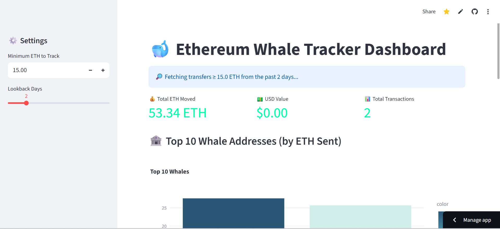

# Tracking Large Ethereum Transfers with a Lightweight On-Chain Analytics Tool

Large Ethereum transfers often reflect meaningful capital movement on-chain. This project is a lightweight, near real-time analytics dashboard designed to identify and organize high-value ETH transfers for operational use and exploratory analysis.



## Overview

Public blockchain data is transparent but noisy. The challenge for analysts is not data access, but effective filtering and presentation. This tool focuses on a narrow operational question: **Which large ETH transfers occurred recently, who moved them, and what is their relative scale?**

Unlike speculative tools, this project prioritizes data clarity and reproducibility over predictive modeling or market sentiment analysis.

## Features

- **Dynamic Filtering:** Filter transfers by a user-defined ETH threshold.
- **Contextual Pricing:** Real-time conversion of ETH values to USD via CoinGecko API.
- **Concentration Metrics:** View top sending and receiving addresses by cumulative volume.
- **Exploratory Tools:** Direct links to Etherscan for individual transaction verification.
- **Data Portability:** Export filtered datasets as CSV for downstream analysis.

## Tech Stack

- **Frontend/UI:** [Streamlit](https://simplewhaletracker.streamlit.app/)
- **Blockchain Data:** [Alchemy SDK](https://www.alchemy.com) (`alchemy_getAssetTransfers`)
- **Market Data:** [CoinGecko API](https://www.coingecko.com)
- **Data Processing:** [Pandas](https://pandas.pydata.org)

## Design Decisions

### Why Alchemy, Not Etherscan?
During development, I transitioned from Etherscan to Alchemy to resolve rate-limiting issues on free-tier plans. Alchemy’s `alchemy_getAssetTransfers` endpoint provides a cleaner abstraction for asset movement, allowing for exploratory analysis without requiring address pre-selection or complex client-side logic.

### Data Filtering Logic
To maintain a high signal-to-noise ratio, the pipeline applies the following constraints:
- **Transfer Scope:** Limited to **external transfers (EOAs)**, excluding internal contract execution traces and "noise" from automated smart contract calls.
- **Lookback Window:** Optimized for the last 1,000–2,000 blocks to ensure high performance within RPC limits.
- **Exclusions:** All zero-value and failed transactions are stripped before aggregation.

## Installation & Setup

1. **Clone the repository:**
   ```bash
   git clone https://github.com[your-username]/[repo-name].git
   cd [repo-name]
2. **Install dependencies:**
    ```bash
    pip install -r requirements.txt
3. **Configure API Keys:**
   Create a .env file or export your Alchemy API Key:
   ```env
   ALCHEMY_API_KEY=your_alchemy_key_here
4. **Run the application:**
   ```bash
   streamlit run app.py

## What This Tool Does and Does Not Do
This tool is designed to:
- Identify and organize large-scale ETH movements.
- Provide context around volume concentration.
- Make recent on-chain activity easier to inspect.

It does NOT:
- Predict price movements or market trends.
- Automatically label entities (e.g., distinguishing between an exchange and a private whale).
- Track smart-contract-level internal activity.

## License
Distributed under the MIT License. See LICENSE for more information.